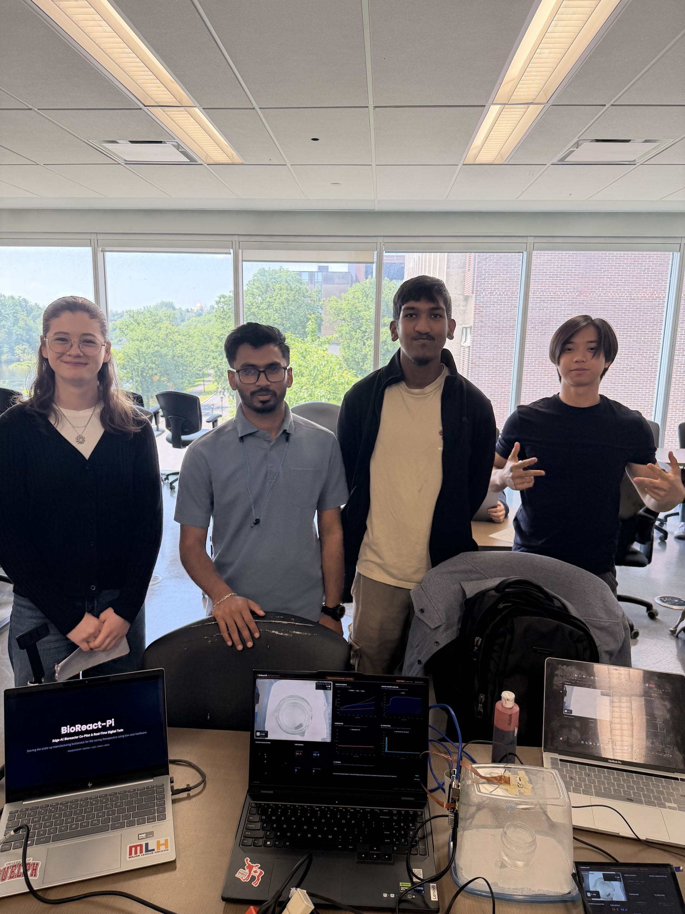
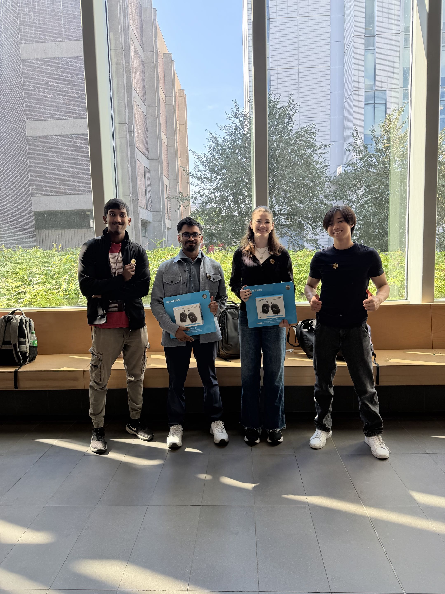
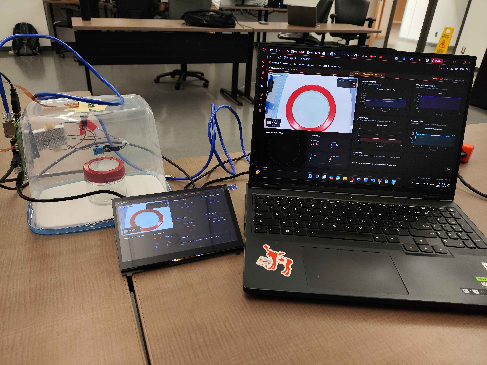
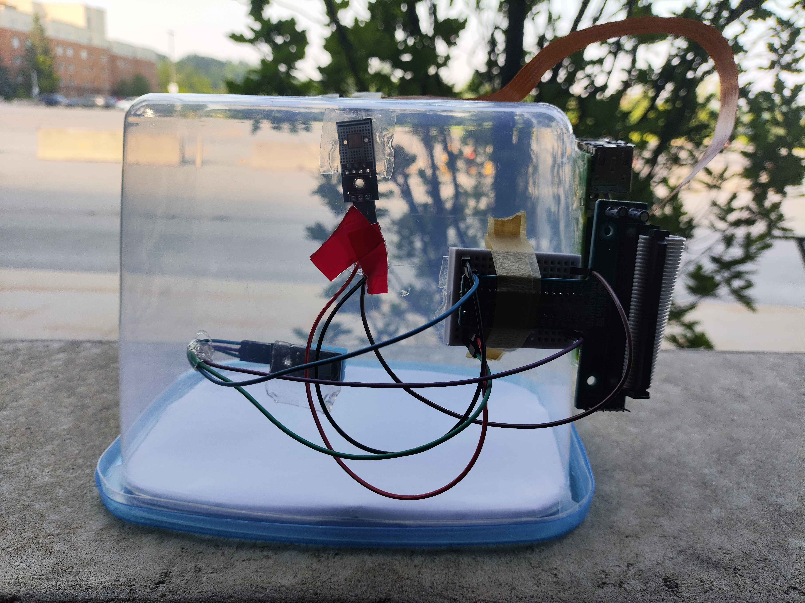
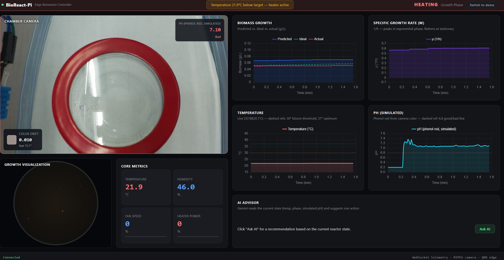
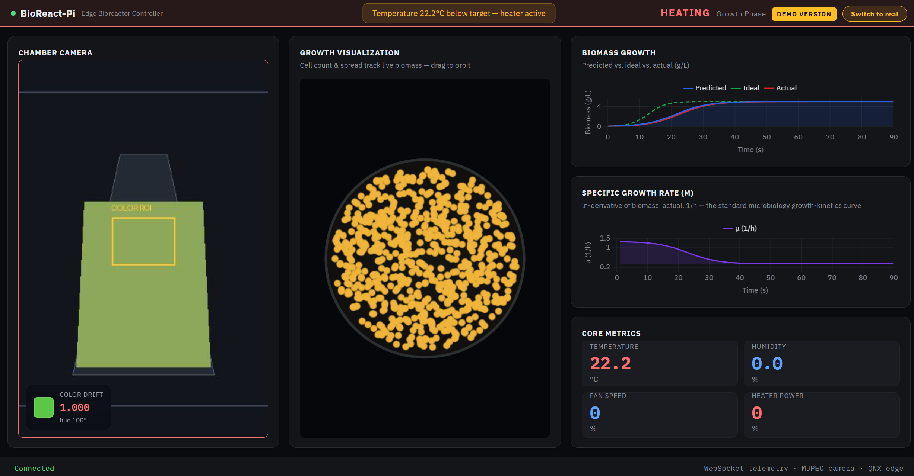

# BioReactPi : An EdgeAI Bioreactor Controller on Raspberry Pi · CU Hacking 2026 · 🥉 3rd Place Overall

<p align="justify">
Edge-AI bioreactor controller built on a Raspberry Pi. BioReact-Pi reads a live temperature sensor inside the chamber, feeds it into a logistic growth model to predict bacterial biomass, and streams everything to a live web dashboard — including a top-down "petri dish" visualization where you can watch colonies grow in real time as you change the temperature.
</p>

---

## 🏆 Outcome — 3rd Place Overall · CU Hacking 2026

<p align="center">
  
  
</p>

<p align="center">
  
  
</p>

<p align="center">
  
</p>

<p align="center">
  <a href="https://www.youtube.com/watch?v=ssAZ3tU2ldw">
    
  </a><br/>
  <sub>▶ Click to watch the live demo</sub>
</p>

---

## Overview

<p align="justify">
Industrial bioreactors grow bacteria for medicine, insulin, clean meat, and biofuels. Small deviations in temperature can ruin an entire batch. BioReact-Pi closes the loop between sensing, prediction, and visualization on low-cost hardware: a Raspberry Pi reads the real chamber temperature, an edge service turns that into a live growth curve using real logistic growth kinetics, and a web dashboard renders it — biomass charts, growth-rate kinetics, and an animated petri dish — updating every second.
</p>

> **Heads up:** this README documents what's actually running today. The original hackathon pitch (QNX + DHT22 + PID + full actuator loop) is preserved as the project vision in [docs/PITCH.md](docs/PITCH.md). The team pragmatically pivoted the OS and sensor mid-hackathon — see [CLAUDE.md](CLAUDE.md) for the full story of what was tried, what failed, and why.

**Core capabilities:**

- Real DS18B20 temperature sensor and DHT11 humidity sensor, read live on a Raspberry Pi (Ubuntu/Raspberry Pi OS)
- Live camera feed (Pi Camera Module via `picamera2`) — the dashboard's camera panel shows the real chamber view, not a placeholder
- Logistic growth model calibrated to the E. coli reference range — grows strictly between **8°C and 50°C**, peaks at **37°C** — predicting biomass in real time from temperature alone (no assumed/guessed humidity). The exact same formula runs on the Pi and in the browser
- A **simulated pH indicator**: real color extracted from the camera's ROI, interpreted through the same phenol-red colorimetric convention used in real cell-culture media (yellow=acidic, red/pink=optimal, magenta=alkaline)
- An on-demand **AI advisor** (Gemini) — reads the current temperature/phase/biomass/pH and gives one concrete recommendation
- Live web dashboard: biomass curve, specific growth-rate (μ) chart, animated petri-dish colony visualization, chamber camera panel, core metrics
- **Real mode vs. Demo mode** — real mode shows true instrument-paced growth from the actual sensor; demo mode runs the *same* biology formula on a fast-forwarded clock so a hair dryer on the sensor visibly races the plate to full coverage within seconds, for live demos
- Mock or hardware data sources, switchable via environment variables — the dashboard looks and behaves identically either way
- **Honest about disconnection** — if the Pi is unreachable, the dashboard says so explicitly (a distinct "DISCONNECTED" state) instead of silently showing stale or canned numbers
- Digital twin (`digital_twin/simulator.py`) for offline what-if growth simulation

## Quick Start

### 1. Dashboard only (no hardware needed)

```bash
git clone https://github.com/Anaskaysar/BioReact-Pi.git
cd BioReact-Pi
python3 -m venv venv
source venv/bin/activate        # Windows: venv\Scripts\activate
pip install -r requirements.txt
python ui/run_dashboard.py
```

Open **http://localhost:8000**. This runs in **mock mode** by default — a simulated growth curve drives every panel, so anyone can explore the UI without a Pi.

### 2. Connect to the real Raspberry Pi

Two machines, two scripts — see [Hardware Setup](#hardware-setup) below for the full wiring/OS walkthrough.

**On the Pi** (has the DS18B20 sensor wired in):

```bash
sudo apt install python3-flask   # or: pip install flask --break-system-packages
python3 pi_edge_server.py
```

**On your laptop** (runs the dashboard, points at the Pi's IP):

```bash
export BIOREACTOR_DATA_SOURCE=hardware
export BIOREACTOR_HARDWARE_URL=http://<pi-ip>:8080
python ui/run_dashboard.py
```

Open **http://localhost:8000** — the same dashboard now reflects the real sensor.

## Dashboard Features



| Panel | What it shows |
|-------|----------------|
| **Chamber camera** | Live feed from the Pi Camera Module (falls back to a synthetic render in mock mode, or a clearly-labeled "CAMERA OFFLINE" placeholder if the Pi is unreachable) — plus a color-drift indicator and a simulated pH readout (phenol-red convention, from the camera's real ROI color) |
| **Growth visualization** | Top-down animated petri dish — tiny colony dots appear and the plate fills as biomass grows, colored by growth phase (amber = lag, green = exponential, blue = stationary) |
| **Biomass growth** | Predicted / ideal / actual biomass (g/L) over time |
| **Specific growth rate (μ)** | ln-derivative of biomass — the standard microbiology way to read growth kinetics; peaks in exponential phase, flattens at stationary |
| **Core metrics** | Temperature, humidity, fan speed, heater power — shown as `--` instead of a number whenever the Pi is disconnected |
| **AI advisor** | Click "Ask AI" for one concrete recommendation from Gemini, based on the current temperature/phase/biomass/pH (needs `GEMINI_API_KEY`, see below) |

### Real mode vs. Demo mode

<p align="justify">
A toggle in the top-right of the dashboard switches between two ways of driving the biomass visualization — both use the <em>same</em> growth-kinetics formula (ported 1:1 between Python and JavaScript), just at different clock speeds:
</p>

- **Real mode** (default) — biomass comes straight from the Pi's edge service, integrated at true pace against the real sensor reading. This is what the culture is actually doing.
- **Demo mode** — runs the identical formula client-side, but on an accelerated clock, still driven by the real temperature reading. Point a hair dryer at the DS18B20 and watch the petri dish fill up within ~20 seconds instead of real-world hours. A **"Demo version"** badge appears whenever this mode is active, so it's never mistaken for real data.

### AI advisor setup (optional)

Get a free key at [aistudio.google.com/apikey](https://aistudio.google.com/apikey), then before starting the dashboard:

```bash
export GEMINI_API_KEY=your-key-here
```

Without it, the "Ask AI" button just shows a clear "not configured" message — nothing else on the dashboard depends on this.

## Hardware Setup

### Bill of materials (what's actually wired up)

| Component | Purpose | Status |
|-----------|---------|--------|
| Raspberry Pi (Ubuntu / Raspberry Pi OS) | Edge controller | Working |
| DS18B20 (1-Wire digital temp sensor) | Chamber temperature | Working — see wiring below |
| Pi Camera Module (CSI ribbon) | Chamber view + pH color detection | Working — served via `picamera2`, see below |
| DHT11 (humidity) | Chamber humidity | Working — humidity is read live from the sensor and passed through the dashboard |
| Heater / cooling fan | Actuation | **Not wired yet** — dashboard reports 0% power, no physical control loop yet |
| Acrylic chamber | Enclosure | Erlenmeyer flask with culture medium |

### DS18B20 wiring

| Pin | Connects to |
|-----|-------------|
| DATA | GPIO17 (via extension cable into a breadboard — do **not** hand-hold the wires, see [CLAUDE.md](CLAUDE.md) for why) |
| VCC | 3.3V |
| GND | GND |

### Camera setup

The Pi Camera Module connects via its CSI ribbon cable (not GPIO). No pin table needed — just make sure it's enabled and `picamera2` is installed:

```bash
sudo apt install python3-picamera2
```

`edge/pi_edge_server.py` auto-detects it at startup and prints `[OK] Camera streaming at 640x480`. If no camera is attached (or the library is missing), it prints a `[WARN]` and everything else — temperature, growth model — keeps working normally; only `/api/camera/stream` returns a 503.

### Raspberry Pi OS setup

1. Edit `/boot/firmware/config.txt`, add:
   ```
   dtoverlay=w1-gpio,gpiopin=17,pullup=on
   ```
2. `sudo reboot`
3. Verify detection: `ls /sys/bus/w1/devices/` — look for a folder prefixed `28-` (that's the DS18B20's unique ID; a `00-` prefix means insufficient pull-up).
4. Quick manual read: `cat /sys/bus/w1/devices/28-*/w1_slave` — a line ending `YES` means the CRC checked out; `t=26187` means 26.187°C.

### Deploying the edge service

`edge/pi_edge_server.py` is a **single self-contained file** — it embeds its own copy of the growth model, so it's all you need to copy onto the Pi (no need to clone the whole repo there):

```bash
scp edge/pi_edge_server.py user@<pi-ip>:~/
ssh user@<pi-ip>
sudo apt install python3-flask python3-picamera2   # picamera2 only needed if a camera is attached
python3 pi_edge_server.py
```

It auto-detects the DS18B20 and camera, integrates the growth model against the real reading every second, and serves telemetry at `GET /api/telemetry` and the camera at `GET /api/camera/stream` in the shapes the dashboard expects. See the file's own docstring for the full protocol and every tunable environment variable (`TARGET_TEMP`, `SIM_HOURS_PER_SECOND`, `CAMERA_WIDTH`, `CAMERA_HEIGHT`, etc).

### Connecting laptop ↔ Pi over Ethernet

If you're on a direct Ethernet link with no router, assign a fixed IP on the Pi:

```bash
sudo nmcli connection modify "Wired connection 1" ipv4.addresses 169.254.243.2/16 ipv4.method manual
sudo nmcli connection up "Wired connection 1"
```

Then SSH in with `ssh user@169.254.243.2` (or PuTTY on Windows), and point `BIOREACTOR_HARDWARE_URL` at that same IP.

### Pi monitor kiosk mode

If the dashboard server runs on the laptop and you want the Pi's small monitor to show the same UI, open the laptop-hosted dashboard in kiosk mode on the Pi:

```bash
cd ~/Desktop/BioReact-Pi
chmod +x scripts/pi_kiosk_dashboard.sh
./scripts/pi_kiosk_dashboard.sh http://169.254.243.1:8000
```

That opens the laptop's dashboard on the Pi monitor full-screen, while the laptop can still show `http://localhost:8000`.

## Architecture

```
┌─────────────────────┐   GET /api/telemetry, /api/camera/stream   ┌──────────────────────┐        WebSocket        ┌────────────────┐
│   Raspberry Pi       │ ───────────────────────────────────────── ▶│  Dashboard backend    │ ───────────────────────▶│   Browser       │
│  DS18B20 (1-Wire)    │        (every ~1s, port 8080)               │  FastAPI (port 8000)  │     (every ~1s)          │   Dashboard UI  │
│  Camera Module       │                                             │  ui/api/*             │──── POST /api/advisor ─▶│   Chart.js +    │
│  edge/pi_edge_server │                                             │                       │        (Gemini)         │   Three.js      │
│  .py + GrowthModel   │                                             │                       │                          │                 │
└─────────────────────┘                                             └──────────────────────┘                          └────────────────┘
```

**Data flow:**

1. `edge/pi_edge_server.py` reads the DS18B20 (median-smoothed over the last 5 reads to reject wiring noise) and the camera, integrates the growth model against that real temperature every second, and serves both as JSON/JPEG.
2. `ui/api/hardware.py` polls those endpoints (off the main event loop — see [CLAUDE.md §5.9](CLAUDE.md) for why that matters) and normalizes telemetry into the dashboard's WebSocket packet shape (or `ui/api/telemetry.py` generates the same shape from a mock simulation when no hardware is configured). `ui/api/color_ph.py` extracts real color from the camera's ROI and overlays a simulated pH reading onto that packet.
3. `ui/dashboard/js/app.js` renders it: Chart.js for the biomass/growth-rate curves, Three.js for the petri dish, plus the metric cards and camera panel — all from the one WebSocket stream. Clicking "Ask AI" makes a separate one-off REST call to `ui/api/advisor.py`, which asks Gemini for a recommendation.

## Tech Stack

| Component | Role |
|-----------|------|
| **Python / Flask** | Edge service on the Pi (`edge/pi_edge_server.py`) |
| **picamera2** | Pi Camera Module capture |
| **Python / FastAPI** | Dashboard backend — WebSocket telemetry, camera proxy, static files |
| **Pillow** | Real-time ROI color extraction for the simulated pH indicator |
| **google-genai** | Gemini AI advisor (current SDK — `google-generativeai` is deprecated) |
| **Chart.js** | Biomass and specific growth-rate charts |
| **Three.js** | Petri dish growth visualization (orthographic camera, `PointsMaterial` colony dots) |
| **WebSocket + MJPEG** | Live telemetry and camera streaming to the browser |

## Project Structure

```
BioReact-Pi/
├── README.md
├── CLAUDE.md                    # Full engineering log — hardware bring-up + dashboard build
├── requirements.txt
├── docs/
│   ├── PITCH.md                  # Hackathon pitch & judging narrative (project vision)
│   └── ui-dashboard.png          # Dashboard screenshot
├── edge/
│   └── pi_edge_server.py         # Self-contained edge service — runs ON the Pi
├── src/
│   └── models/
│       └── growth_model.py       # Logistic growth model (shared source of truth)
├── digital_twin/
│   └── simulator.py              # Offline growth simulation
├── tests/
│   ├── test_growth_model.py
│   └── test_simulator.py
└── ui/
    ├── run_dashboard.py          # Start the web dashboard
    ├── config.py                 # Mock vs. hardware data source (env vars)
    ├── .env.example              # Hardware connection settings
    ├── data/
    │   └── demo_telemetry.json   # Sample edge payload shape (reference only, not a live fallback)
    ├── api/                      # FastAPI — telemetry, camera, static files
    │   ├── advisor.py             # Gemini AI advisor
    │   └── color_ph.py            # Real camera color -> simulated phenol-red pH
    └── dashboard/                # HTML / CSS / JS frontend
        ├── index.html
        ├── css/style.css
        └── js/app.js
```

## Known Limitations / Roadmap

- **Humidity** — live DHT11 reading from the chamber. If the sensor is unavailable, the dashboard shows `--` instead of inventing a value.
- **Actuators** — no heater/fan hardware wired yet. Dashboard reports 0% power rather than simulating a value, so nothing on screen is faked.
- **Camera framing** — the camera shows whatever the Pi happens to be pointed at; the pH reading is only meaningful once it's aimed at the actual flask/chamber.
- **AI advisor** — needs a `GEMINI_API_KEY` (see [above](#ai-advisor-setup-optional)); without one it just says so.
- **QNX** — the original hackathon requirement targeted QNX on a Pi 5, but 1-Wire bit-banging over QNX's GPIO IPC resource manager proved unreliable within the hackathon's time budget (full root-cause writeup in [CLAUDE.md](CLAUDE.md)). The team pivoted to Ubuntu/Raspberry Pi OS, which handles the DS18B20 with a native kernel driver (`w1-gpio`/`w1-therm`) instead of hand-rolled timing-critical bit-banging.

## Team

| Name | Role | University |
|------|------|------------|
| Solarcemir | Hardware / embedded | University of Guelph |
| Arkesh | Growth model & control | University of Guelph |
| Anas | UI & digital twin | Laurentian University |
| Anna | Bio Med | University of Guelph |

<p align="justify">
Hackathon pitch, judging alignment, demo script, and sponsor integrations: <a href="docs/PITCH.md">docs/PITCH.md</a>
</p>

**Project links:** [Devpost](https://devpost.com/software/bioreactpi-an-edgeai-bioreactor-controller-on-raspberry-pi?_gl=1*1qvzukt*_gcl_au*NDkyNDc2Nzk0LjE3ODI1Njc5MDA.*_ga*MjkyMDAyNDU4LjE3ODI1Njc5MDA.*_ga_0YHJK3Y10M*czE3ODM5ODg2MDUkbzE2JGcwJHQxNzgzOTg2ODA1JGo2MCRsMCRoMA..) · [GitHub](https://github.com/Anaskaysar/BioReact-Pi)

## Gallery

### 🏆 Winning Moment

<div style="display: flex; gap: 12px; flex-wrap: wrap; margin-bottom: 16px;">
  
</div>

### 🔬 Project Build

<div style="display: flex; gap: 12px; flex-wrap: wrap;">
  
  
  
  
</div>

## License

MIT (TBD)
