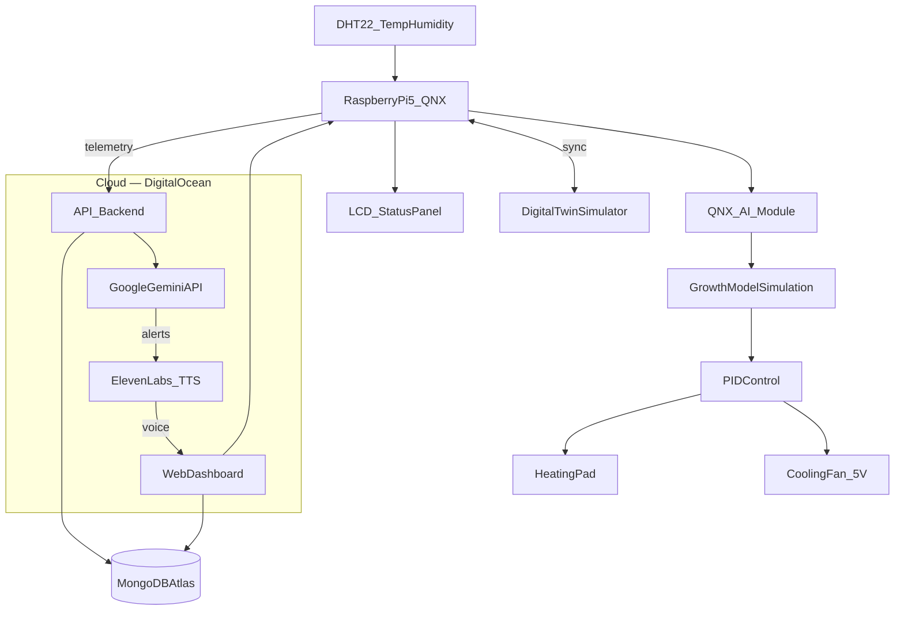

# BioReact-Pi

<p align="justify">
Edge-AI bioreactor controller on Raspberry Pi 5 with QNX — live growth simulation synchronized with real-world sensor data to optimize bacterial batch yield.
</p>

## Hackathon

<p align="justify">
BioReact-Pi is built for <strong>The QNX Hackathon Challenge</strong> at CU Hacking — create an embedded system with QNX that uses AI. Loaner Raspberry Pi 5 boards (pre-loaded with QNX and cameras) are provided on-site.
</p>


### Hard requirements

| Requirement | How BioReact-Pi meets it |
|-------------|--------------------------|
| Product uses **QNX OS** | Runs on loaner Raspberry Pi 5 pre-loaded with QNX |
| Includes an **open-source AI module** from [oss.qnx.com](https://oss.qnx.com) | On-device AI inference for growth prediction and anomaly detection via QNX AI modules |

### Judging alignment

| Criterion | BioReact-Pi answer |
|-----------|-------------------|
| "Cannot-fail" embedded application? | Yes — prevents $100k batch failure via real-time temperature control |
| Requires real-time or reliability? | Yes — PID loops with sub-second actuator response on QNX |
| AI used in an interesting way? | Yes — logistic growth model + QNX AI modules predict biomass and flag batch risk on-edge |
| Running on embedded hardware (not cloud)? | Yes — growth model, PID, and AI inference run on the Pi; cloud is logging/dashboard only |


**Target categories:** Best Hardware Hack, Best AI Hack, QNX Challenge (1st–3rd place)

<p align="justify">
Opening ceremony slides: [docs/cuHacking Opening Ceremony (1).pdf](docs/cuHacking%20Opening%20Ceremony%20(1).pdf)
</p>

## Problem

<p align="justify">
Industrial bioreactors grow bacteria for medicine, insulin, clean meat, and biofuels. If temperature or feeding schedule drifts even slightly, the entire batch can fail. A 1°C temperature shift can ruin a $100,000 production run.
</p>

## Solution

<p align="justify">
BioReact-Pi acts as the brain of a bioreactor. It reads temperature from a sensor, runs a live logistic growth model in Python to predict future biomass yield, and uses PID control to dynamically adjust a heater and nutrient feeder — keeping bacteria in the optimal exponential growth phase.
</p>

**Key features:**

- Real-time temperature sensing (DHT22 primary path)
- Live logistic growth simulation and yield prediction
- PID feedback loops for heater and nutrient pump actuation
- Live UI comparing actual vs. ideal growth curves
- Digital twin for offline bacteria growth simulation and what-if testing
- Google Gemini API for intelligent batch analysis and natural-language alerts (cloud supplement)
- ElevenLabs voice alerts for hands-free operator feedback during demos
- MongoDB Atlas for cloud logging of sensor readings and growth history
- DigitalOcean-hosted web dashboard and API backend
- QNX open-source AI modules for on-device growth inference ([oss.qnx.com](https://oss.qnx.com))

## Demo

<p align="justify">
The BioReact-Pi prototype combines edge control, physical actuators, and a live web dashboard. A DHT22 sensor reads chamber conditions; a Raspberry Pi 5 running QNX executes growth simulation, PID control, and on-device AI inference; a heating pad and 5V fan regulate temperature; and a web interface plots predicted vs. ideal vs. actual biomass growth in real time.
</p>


**What the demo shows:**

- **System architecture** — DHT22 → Raspberry Pi 5 (QNX) → heater & cooling fan → web dashboard
- **Physical prototype** — acrylic bioreactor chamber, LCD readout, and HEATING / STABLE / COOLING status LEDs
- **Web dashboard** — live biomass curve, actuator output (heater power, fan speed), and system alerts
- **Operating states** — chamber lighting reflects heating (red), stable (green), and cooling (blue) modes

## Architecture



**Data flow:**

1. DHT22 reads temperature and humidity inside the chamber.
2. Growth model updates biomass prediction using logistic growth dynamics.
3. PID controller compares actual vs. target temperature and outputs heater/fan signals.
4. Heating pad and cooling fan regulate chamber temperature.
5. LCD panel and status LEDs show temp, biomass, phase, and HEATING / STABLE / COOLING state.
6. Web dashboard (hosted on DigitalOcean) renders predicted vs. ideal vs. actual growth curves and actuator output.
7. Telemetry is logged to MongoDB Atlas for batch history and replay.
8. Google Gemini API analyzes anomalies and generates plain-language alert summaries.
9. ElevenLabs converts alerts into voice feedback for hands-free demo narration.
10. Digital twin mirrors the physical system for simulation and calibration.

## Tech Stack

| Tool | Role in BioReact-Pi |
|------|---------------------|
| **QNX OS** | Real-time embedded OS on Raspberry Pi 5 — PID, sensors, actuators |
| **QNX AI modules** ([oss.qnx.com](https://oss.qnx.com)) | On-device growth inference and anomaly detection (judging requirement) |
| **Google Gemini API** | Cloud supplement — interprets deviations and generates alert summaries |
| **ElevenLabs** | Text-to-speech voice alerts for live demo narration |
| **MongoDB Atlas** | Cloud store for sensor telemetry, biomass history, and batch records |
| **DigitalOcean** | Hosts the web dashboard, REST API, and cloud services |

## Hardware

### Bill of materials

| Component | Purpose | Notes |
|-----------|---------|-------|
| Raspberry Pi 5 | Edge controller | Loaner board — QNX pre-loaded, camera included |
| DHT22 sensor | Temperature & humidity | Inside bioreactor chamber |
| Heating pad | Temperature control | Under flask base |
| 5V cooling fan | Temperature control | Active cooling when above target |
| LCD display | Local readout | Temp, target, biomass, growth phase |
| Status LEDs | HEATING / STABLE / COOLING | Red, green, blue indicators |
| Acrylic chamber | Demo enclosure | Erlenmeyer flask with culture medium |

### Primary demo path

<p align="justify">
Full prototype as shown in [docs/demo.png](docs/demo.png): DHT22 inside the chamber, heating pad and cooling fan for closed-loop temperature control, front-panel LCD and status LEDs, and a web dashboard for live growth curves and actuator output.
</p>

### Fallback demo path

<p align="justify">
If no DHT sensor is available, use a potentiometer on an analog input (via ADC) or a GPIO-readable dial to simulate temperature for demo purposes.
</p>

### GPIO pin assignments

| Pin (BCM) | Connection | Direction |
|-----------|------------|-----------|
| GPIO 4 | DHT22 data | Input |
| GPIO 17 | Heating pad relay | Output |
| GPIO 27 | Cooling fan | Output |
| GPIO 22 | Potentiometer (fallback) | Input |

> Pin numbers are placeholders — adjust to match your wiring. See [docs/WIRING.md](docs/WIRING.md) when available.

## Software Setup

### Prerequisites

- QNX on Raspberry Pi 5 (loaner hardware provided at hackathon)
- QNX open-source AI module from [oss.qnx.com](https://oss.qnx.com)
- Python 3.9+ / C++ (per QNX toolchain)
- MongoDB Atlas cluster (free tier)
- DigitalOcean Droplet or App Platform for dashboard + API
- Google Gemini API key
- ElevenLabs API key

### Installation

```bash
git clone <repo-url>
cd CU_Hacking
python3 -m venv venv
source venv/bin/activate
pip install -r requirements.txt
cp .env.example .env   # add GEMINI, ELEVENLABS, MONGODB, DO credentials
```

### Dependencies

<p align="justify">
See [requirements.txt](requirements.txt). Packages will include GPIO, DHT sensor, and plotting libraries once implementation begins.
</p>

### Dashboard (UI)

```bash
source venv/bin/activate
python ui/run_dashboard.py
```

Open **http://localhost:8000**. By default the UI runs in **mock** mode (simulated growth + synthetic camera).

**Switch to live hardware** — set env vars (see `ui/.env.example`) before starting:

```bash
export BIOREACTOR_DATA_SOURCE=hardware
export BIOREACTOR_HARDWARE_URL=http://<pi-ip>:8080
python ui/run_dashboard.py
```

The UI polls `BIOREACTOR_HARDWARE_URL` + `BIOREACTOR_HARDWARE_TELEMETRY_PATH` and proxies the camera stream. Payload shape is documented in `ui/data/demo_telemetry.json`.

### Edge controller (Pi / QNX)

```bash
source venv/bin/activate
python src/main.py
```

**Expected demo behavior:**

- Web dashboard shows predicted, ideal, and actual biomass growth curves
- LCD displays temp (e.g. 28.4 °C), target (30.0 °C), biomass (0.72 g/L), and growth phase
- HEATING / STABLE / COOLING LEDs and chamber lighting reflect live control state
- Heater power and fan speed bars update as PID responds to temperature drift
- Gemini-generated alerts appear in the dashboard when growth deviates from ideal
- ElevenLabs plays voice alerts for critical state changes (heating, stable, cooling)
- All telemetry persists to MongoDB Atlas for batch replay and judge review
- Digital twin can run standalone for simulation without hardware

## Project Structure

```
CU_Hacking/
├── README.md
├── requirements.txt
├── .env.example
├── docs/
│   ├── demo.png                      # Demo architecture, hardware, and dashboard
│   ├── qnx-hackathon-challenge.png   # QNX challenge requirements
│   ├── prizes.png                    # CU Hacking prize categories
│   ├── cuHacking Opening Ceremony (1).pdf
│   └── PITCH.md
├── src/
│   ├── main.py              # Pi entry point
│   ├── sensors/             # DHT22 / fallback input
│   ├── models/              # Logistic growth model
│   ├── control/             # PID controller
│   └── display/             # Local LCD / LED display
├── ui/
│   ├── run_dashboard.py     # Start the web dashboard
│   ├── config.py            # Mock vs hardware data source settings
│   ├── .env.example         # Hardware connection strings
│   ├── data/
│   │   └── demo_telemetry.json  # Sample edge payload shape
│   ├── api/                 # FastAPI — telemetry, camera, static files
│   └── dashboard/           # HTML / CSS / JS frontend
└── digital_twin/
    └── simulator.py         # Offline growth simulation
```

## Demo / Pitch

<p align="justify">
Industrial biotechnology relies on living organisms to produce everything from insulin to biofuels, but a 1-degree temperature shift can ruin a $100,000 batch. BioReact-Pi embeds predictive biological growth models and active PID control loops on a low-cost Raspberry Pi — a self-optimizing edge system that prevents batch failure in real time.
</p>

Full pitch script: [docs/PITCH.md](docs/PITCH.md)

## Team

| Name | Role |
|------|------|
| Solarcemir | Hardware / embedded |
| Arkesh | Growth model & control |
| Anas | UI & digital twin |
| Anna | Bio Med |

## License

MIT (TBD)
