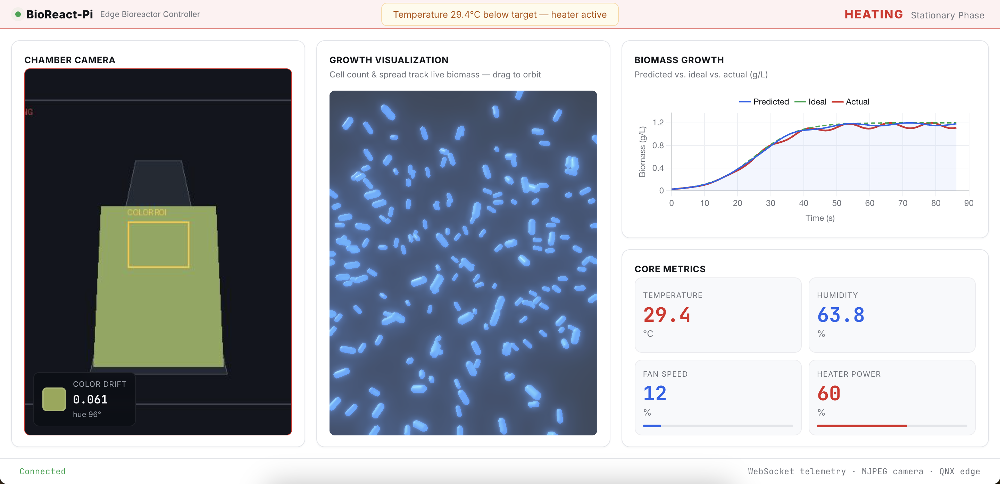
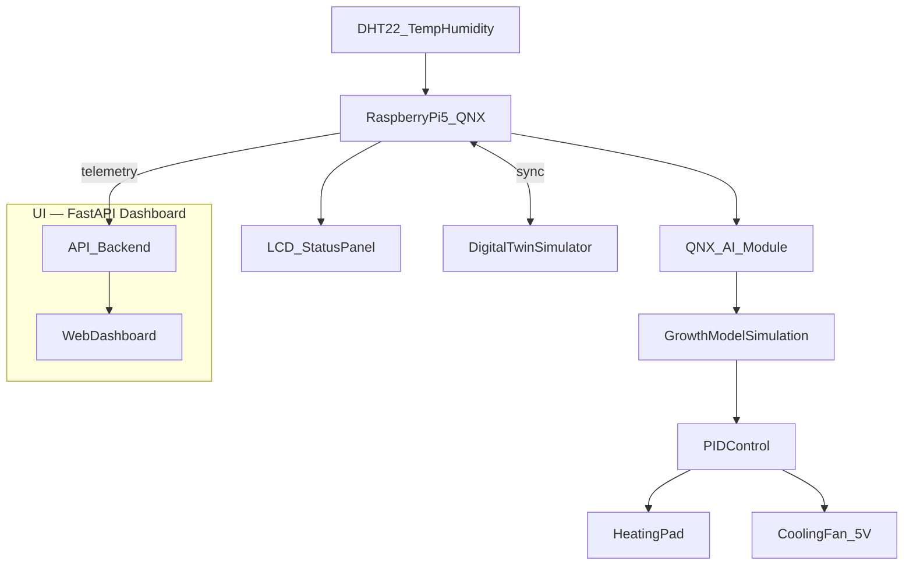

# BioReact-Pi

<p align="justify">
Edge-AI bioreactor controller on Raspberry Pi 5 with QNX. BioReact-Pi reads live chamber sensors, runs a logistic growth model to predict biomass yield, and uses PID control to adjust heating and cooling — keeping bacterial cultures in their optimal growth phase.
</p>

## Overview

<p align="justify">
Industrial bioreactors grow bacteria for medicine, insulin, clean meat, and biofuels. Small deviations in temperature or feeding can ruin an entire batch. BioReact-Pi is an embedded control system that closes the loop between sensing, prediction, and actuation on low-cost hardware, with a live web dashboard for monitoring and review.
</p>

**Core capabilities:**

- Real-time temperature and humidity sensing (DHT22 primary path)
- Logistic growth model for biomass prediction
- PID feedback loops for heater and cooling fan actuation
- Live web UI — biomass curves, 3D growth visualization, chamber camera, core metrics
- Mock or hardware data sources (switch via environment variables)
- Digital twin for offline simulation and what-if testing (planned)
- QNX open-source AI modules for on-device inference ([oss.qnx.com](https://oss.qnx.com))

## Web Dashboard

<p align="justify">
The dashboard runs locally via FastAPI and streams telemetry over WebSocket. In development it uses simulated growth data; when the Pi edge service is connected, the same UI reads live hardware with no frontend changes.
</p>



```bash
source venv/bin/activate
python ui/run_dashboard.py
```

Open **http://localhost:8000**.

**Mock mode (default)** — simulated growth curve and synthetic camera feed.

**Hardware mode** — point at the Pi/QNX edge service:

```bash
export BIOREACTOR_DATA_SOURCE=hardware
export BIOREACTOR_HARDWARE_URL=http://<pi-ip>:8080
python ui/run_dashboard.py
```

Connection settings and payload format: `ui/.env.example`, `ui/data/demo_telemetry.json`.

## Architecture



**Data flow:**

1. DHT22 reads temperature and humidity inside the chamber.
2. Growth model updates biomass prediction using logistic growth dynamics.
3. PID controller compares actual vs. target temperature and outputs heater/fan signals.
4. Heating pad and cooling fan regulate chamber temperature.
5. LCD panel and status LEDs show temp, biomass, phase, and HEATING / STABLE / COOLING state.
6. Web dashboard renders predicted vs. ideal vs. actual growth curves, actuator output, and chamber camera feed.
7. Digital twin mirrors the physical system for simulation and calibration.

## Tech Stack

| Component | Role |
|-----------|------|
| **QNX OS** | Real-time embedded OS on Raspberry Pi 5 — sensors, PID, actuators |
| **QNX AI modules** ([oss.qnx.com](https://oss.qnx.com)) | On-device growth inference and anomaly detection |
| **Python / FastAPI** | Edge logic and dashboard API |
| **Chart.js + Three.js** | Biomass chart and 3D growth visualization |
| **WebSocket + MJPEG** | Live telemetry and camera streaming |

## Hardware

### Bill of materials

| Component | Purpose | Notes |
|-----------|---------|-------|
| Raspberry Pi 5 | Edge controller | QNX pre-loaded, camera included |
| DHT22 sensor | Temperature & humidity | Inside bioreactor chamber |
| Heating pad | Temperature control | Under flask base |
| 5V cooling fan | Temperature control | Active cooling when above target |
| LCD display | Local readout | Temp, target, biomass, growth phase |
| Status LEDs | HEATING / STABLE / COOLING | Red, green, blue indicators |
| Acrylic chamber | Enclosure | Erlenmeyer flask with culture medium |

### Fallback input

<p align="justify">
If no DHT sensor is available, a potentiometer on an analog input (via ADC) or a GPIO-readable dial can simulate temperature for bench testing.
</p>

### GPIO pin assignments

| Pin (BCM) | Connection | Direction |
|-----------|------------|-----------|
| GPIO 4 | DHT22 data | Input |
| GPIO 17 | Heating pad relay | Output |
| GPIO 27 | Cooling fan | Output |
| GPIO 22 | Potentiometer (fallback) | Input |

> Pin numbers are placeholders — adjust to match your wiring.

## Software Setup

### Prerequisites

- QNX on Raspberry Pi 5
- QNX open-source AI module from [oss.qnx.com](https://oss.qnx.com)
- Python 3.9+

### Installation

```bash
git clone https://github.com/Anaskaysar/BioReact-Pi.git
cd BioReact-Pi
python3 -m venv venv
source venv/bin/activate
pip install -r requirements.txt
```

### Edge controller (Pi / QNX)

```bash
source venv/bin/activate
python src/main.py
```

## Project Structure

```
BioReact-Pi/
├── README.md
├── requirements.txt
├── docs/
│   ├── PITCH.md                 # Hackathon pitch & demo narrative
│   └── ui-dashboard.png         # Current web UI screenshot
├── src/
│   ├── main.py                  # Pi entry point
│   ├── sensors/                 # DHT22 / fallback input
│   ├── models/                  # Logistic growth model
│   ├── control/                 # PID controller
│   └── display/                 # Local LCD / LED display
├── ui/
│   ├── run_dashboard.py         # Start the web dashboard
│   ├── config.py                # Mock vs hardware data source
│   ├── .env.example             # Hardware connection strings
│   ├── data/
│   │   └── demo_telemetry.json  # Sample edge payload shape
│   ├── api/                     # FastAPI — telemetry, camera, static files
│   └── dashboard/               # HTML / CSS / JS frontend
└── digital_twin/
    └── simulator.py             # Offline growth simulation
```

## Team

| Name | Role |
|------|------|
| Solarcemir | Hardware / embedded |
| Arkesh | Growth model & control |
| Anas | UI & digital twin |
| Anna | Bio Med |
| | |
| | |

<p align="justify">
Hackathon pitch, judging alignment, demo script, and sponsor integrations: <a href="docs/PITCH.md">docs/PITCH.md</a>
</p>

## License

MIT (TBD)
