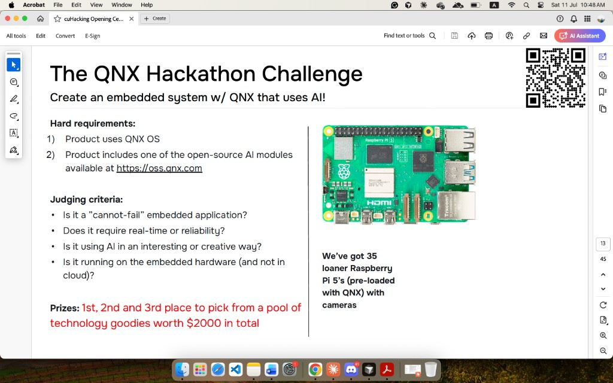
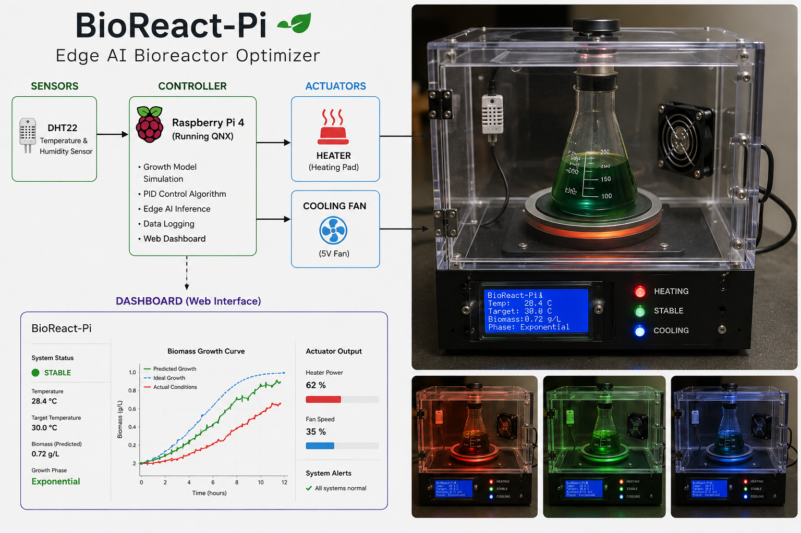

# BioReact-Pi — Pitch Script

## Hackathon context

Built for <strong>The QNX Hackathon Challenge</strong>: embedded system on QNX with AI. We use loaner Raspberry Pi 5 boards (QNX pre-loaded) and QNX open-source AI modules from <a href="https://oss.qnx.com">oss.qnx.com</a> for on-device growth inference — not cloud-dependent AI.

**Judging hooks:**

- **Cannot-fail app** — bioreactor batch protection ($100k at stake)
- **Real-time** — QNX PID control with sub-second heater/fan response
- **Creative AI** — logistic growth model + QNX AI modules predict biomass on-edge
- **Embedded-first** — all critical inference runs on the Pi; cloud is dashboard/logging only

**Target prizes:** Best Hardware Hack, Best AI Hack, QNX Challenge 1st–3rd

## Elevator pitch (30 seconds)

"Industrial biotechnology relies on living organisms to produce everything from insulin to biofuels, but a 1-degree temperature shift can ruin a $100,000 batch. We built BioReact-Pi, an edge-computing bioreactor controller. By embedding predictive biological growth models and active PID control loops directly onto a low-cost Raspberry Pi, we created a self-optimizing system that prevents batch failure in real time."

## Why this stands out

BioReact-Pi introduces real engineering concepts that separate it from basic web-app hackathon projects:

- **Differential equations** — logistic growth model for biomass prediction
- **PID control loops** — closed-loop feedback for heater and feeder actuation
- **Hardware integration** — live sensor input driving real actuators
- **Digital twin** — parallel simulation for calibration and what-if scenarios
- **Sponsor integrations** — Gemini AI, ElevenLabs voice, MongoDB Atlas, and DigitalOcean cloud hosting

## Sponsor tech stack

| Tool | Role |
|------|------|
| **Google Gemini API** | Analyzes batch anomalies and generates plain-language alerts |
| **ElevenLabs** | Voice narration for live demo — "Temperature below target, activating heater" |
| **MongoDB Atlas** | Stores every sensor reading and growth curve for judge review |
| **DigitalOcean** | Hosts the web dashboard and API that ties edge + cloud together |

## Demo

Walk judges through the full stack: block diagram on the left, physical prototype on the right, and the web dashboard at the bottom. The demo proves edge AI, hardware feedback, and predictive biology in one integrated system.

## Demo talking points

1. **QNX + embedded AI** — Lead with QNX on Pi 5 and on-device AI modules — this is the hard requirement judges check first.
2. **Architecture** — DHT22 feeds a Raspberry Pi 5 running QNX: growth simulation, PID control, and edge AI inference.
3. **Hardware** — Point out the LCD (temp, biomass, growth phase) and HEATING / STABLE / COOLING LEDs on the front panel.
4. **Dashboard** — Show predicted vs. ideal vs. actual biomass curves, plus heater power and fan speed outputs.
5. **Live response** — Disturb temperature and watch the chamber shift between heating (red), stable (green), and cooling (blue).
6. **Digital twin** — Switch to simulation mode for what-if scenarios without touching the physical batch.
7. **Gemini + ElevenLabs** — Trigger a growth deviation and let Gemini explain the risk; ElevenLabs reads the alert aloud.
8. **MongoDB Atlas** — Pull up stored telemetry to show full batch history and reproducibility.
9. **DigitalOcean** — Highlight that the dashboard and API run on DO, connecting edge Pi to cloud intelligence.

## Technical depth (for judges)

- Growth model: logistic function \( N(t) = \frac{K}{1 + e^{-r(t - t_0)}} \)
- Control: simplified PID on temperature error and growth-rate deviation
- Edge compute: growth model, PID, and QNX AI modules run on-device (judging requirement)
- Cloud layer: Gemini, ElevenLabs, MongoDB Atlas, DigitalOcean — dashboard and logging only
